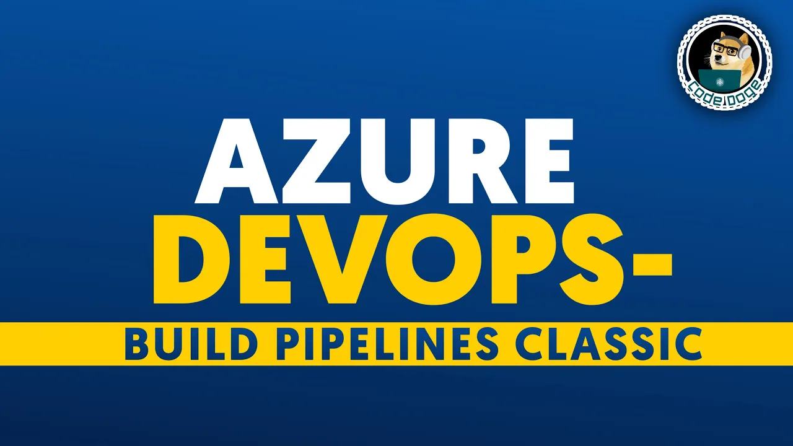

| Youtube Solutions Video Links |[ProgrammingHumor](https://www.youtube.com/playlist?list=PLVCxVHqf-EbJvV4Ys_cs_ixdeWu1QJrzS "Crunch Time") | 
|--------------------------------|-----------------------------------------------------------------------------------------------------------|
|  |  |
|  |   |
|  |   |
|  |   |
|  |  |
|  |   |
|  |   |
|  |   |
|  |   |
|  |  |
| [] (https://www.youtube.com/watch?v=J-PdLSDqAlQ "Introduction to Azure ARM Templates Powershell") |  |
|  |  |
|  |  |
|  |  |
|  |  |
|  |  |
|  |  |
|  |  |
|  |  |
| | |

